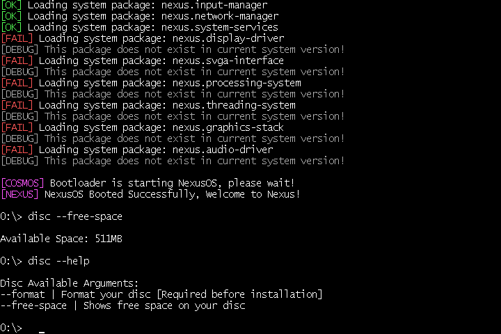

# 🖥️ NexusOS [Operating System]
An experimental operating system written in **C#** using the **COSMOS Framework**.

## 🚧 Under Construction
* **Possible Bugs** - As NexusOS is developed by a single person, bugs and unfinished features may occur.
* **Active Development** - The system is continuously being developed and improved.
* **Frequent Changes** - Features, components and system behavior may change during development.
  

## ☀️ Features
* **Graphics System** — SVGAII Canvas with support for **1920×1080**
* **Advanced Optimization** — System uses advanced Optimization created by **Szyemk44**
* **Processing & Process Management** — Basic Process Execution and Management
* **Command System & Installation** —  Command-Line which helps installing packages/apps support
* **Bash & Graphics Mode** — System is booting in command-line mode by default, use **display --start** for Graphics Mode

## 🖼️ Screenshots

### 💻 Command Prompt & Bootscreen
- The NexusOS command-line interface and bootscreen showcase.
- The command system is currently in an early stage and is actively being expanded with new commands and functionality.

## ⚠️ Important
* **Running NexusOS on real hardware is not recommended** and may potentially damage data on your disc.
* For the best and safest experience, use **VirtualBox** or **VMware [I'm using this most of the time]**.

## ⚒️ Tools
* **Visual Studio 2022** - https://visualstudio.microsoft.com/pl/vs/older-downloads/
* **COSMOS Framework** - https://github.com/CosmosOS/Cosmos
* **COSMOS BMP Converter by Szymekk44** - https://discord.com/channels/992851925894697081/1150514289828954162
> Tools I used while developing this OS. I also used VMware Workstation 17 to run and test my system.

### 📝 Third-Party Credits
> Copyright (c) 2024-2026 Szymekk44  
> CosmosTTF and optimization code are used under the MIT License.  
> Original repository: [Szymekk44 — CosmosOptimizationKit](https://github.com/Szymekk44/Cosmos-Optimization-Kit)

## 📜 Copyrights
> Copyright (c) 2026 Zeroday
> You are free to use, modify, and redistribute NexusOS under the MIT License.
> Credit is appreciated when using substantial portions of NexusOS.
